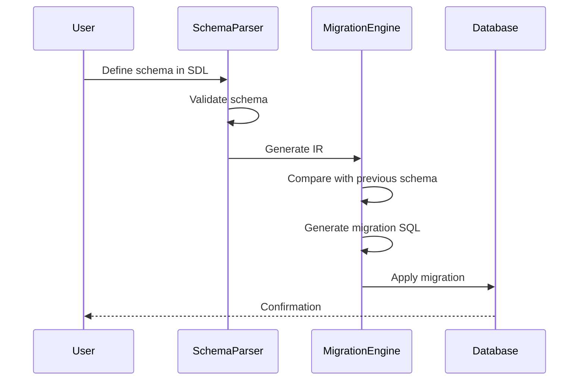
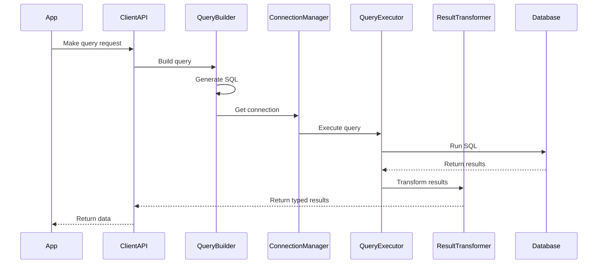
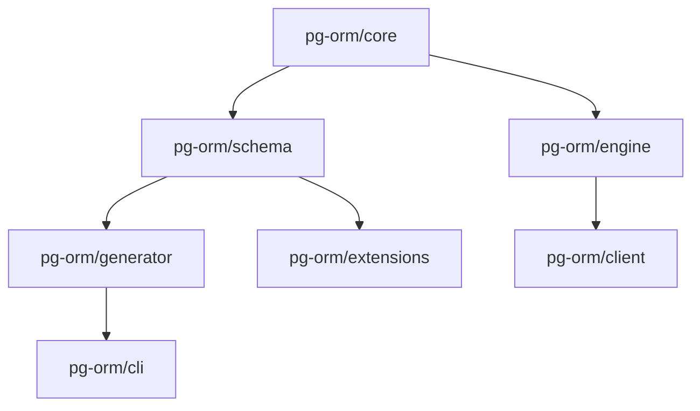
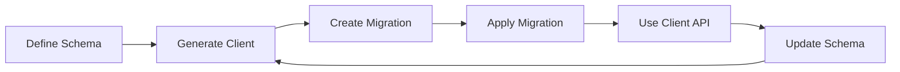

# PG-ORM Architecture Overview

## System Components

PG-ORM follows a layered architecture with the following main components:

### Core Components

```
┌───────────────────┐     ┌───────────────────┐     ┌───────────────────┐
│   Schema Layer    │────▶│   Client Layer    │────▶│  Database Layer   │
└───────────────────┘     └───────────────────┘     └───────────────────┘
          │                        │                         │
          │                        │                         │
          ▼                        ▼                         ▼
┌───────────────────┐     ┌───────────────────┐     ┌───────────────────┐
│  Schema Parser    │     │   Query Builder   │     │ Connection Manager│
└───────────────────┘     └───────────────────┘     └───────────────────┘
          │                        │                         │
          │                        │                         │
          ▼                        ▼                         ▼
┌───────────────────┐     ┌───────────────────┐     ┌───────────────────┐
│ Migration Engine  │     │    Client API     │     │   Query Executor  │
└───────────────────┘     └───────────────────┘     └───────────────────┘
```

### Extension Layer

```
┌─────────────────────────────────────────────────────────────────────┐
│                           Extension Layer                           │
└─────────────────────────────────────────────────────────────────────┘
          │                │                │                 │
          ▼                ▼                ▼                 ▼
┌───────────────┐  ┌───────────────┐  ┌───────────────┐  ┌───────────────┐
│ PostGIS Module│  │ pgVector Module│ │ RLS Module    │  │ FTS Module    │
└───────────────┘  └───────────────┘  └───────────────┘  └───────────────┘
```

## Data Flow

### Schema to Database Flow



### Query Flow



## Package Structure



## Developer Workflow



## Component Responsibilities

| Component | Primary Responsibilities |
|-----------|--------------------------|
| Schema Parser | Parse SDL, validate schema, generate IR |
| Migration Engine | Generate migrations, apply to database |
| Type Generator | Generate TypeScript types from schema |
| Query Builder | Build type-safe SQL queries |
| Connection Manager | Manage database connections and pools |
| Query Executor | Execute SQL, handle parameters and results |
| Extension Modules | Provide PostgreSQL-specific feature support | 